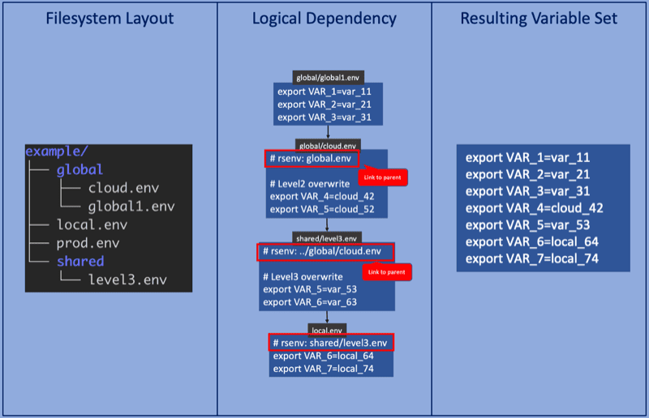
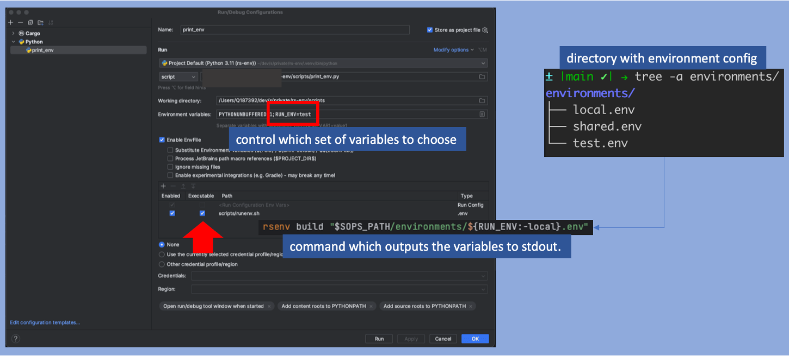

# rs-env

> [Blog: Hierarchical environment variable management](https://sysid.github.io/hierarchical-environment-variable-management/)

# Features
- Compile resulting set of from a hierarchical list of `<name>.env` files.
- Dependencies can form a tree or DAG (directed acyclic graph).
- Last defined variable wins, i.e. child tops parent, rightmost sibling tops left sibling (in case of DAG).
- Smart environment selection via builtin FZF (fuzzy find).
- Quick edit via builtin FZF.
- Side-by-side Tree edit.
- [direnv](https://direnv.net/) integration: Have the resulting variable list written to your `.envrc` file.
- [JetBrains](https://www.jetbrains.com/) integration via [EnvFile](https://plugins.jetbrains.com/plugin/7861-envfile) plugin.

### Concept



### Installation
```bash
cargo install rs-env
```

### Usage
The resulting set of environment variables is an amalgamation of all files involved in the dependency tree, parent variables are overwritten by child variables.

- **DAG**: Directed acyclic graph, i.e. files can have multiple parents
- **branch**: a linear list of files, each file can have one parent (no DAG).
- **tree**: a collection of branches (files can be part of multiple branches, but only one parent)
- environment variables are defined in files `<name>.env` and must be prefixed with `export` command
- See [examples](./rsenv/tests/resources/environments) for DAG, Tree and Branches
- multiple trees/branches per project are supported
- files are linked either manually by adding the comment line `# rsenv: <name.env>` or via the command: `rsenv link <root.env> <child1>.env <child2>.env`.

Source the resulting set of variables as usual:
```bash
source <(rsenv build <leaf-node.env>)
```

```
Hierarchical environment variable management

Usage: rsenv [OPTIONS] [NAME] [COMMAND]

Commands:
  build        Build the resulting set of environment variables (DAG/Tree)
  envrc        Write the resulting set of variables to .envrc (requires direnv, DAG/Tree)
  files        Show all files involved in resulting set (DAG/Tree)
  edit-leaf    Edit the given environment file and all its parents (DAG/Tree)
  edit         Edit the FZF selected branch/DAG
  select-leaf  select environment/branch and update .envrc file (requires direnv, DAG/Tree)
  select       FZF based selection of environment/branch and update of .envrc file (requires direnv, DAG/Tree)
  link         Link files into a linear dependency branch (root -> parent -> child)
  branches     Show all branches (linear representation)
  tree         Show all trees (hierarchical representation)
  tree-edit    Edit branches of all trees side-by-side (vim required in path)
  leaves       Output leaves as paths (Tree)
  help         Print this message or the help of the given subcommand(s)

Arguments:
  [NAME]  Optional name to operate on

Options:
  -d, --debug...              Turn debugging information on
      --generate <GENERATOR>  [possible values: bash, elvish, fish, powershell, zsh]
      --info                  
  -h, --help                  Print help
  -V, --version               Print version
```

#### Basic
<a href="https://asciinema.org/a/605946?autoplay=1&speed=1.5" target="_blank"></a>
<br>

#### Select via FZF
<a href="https://asciinema.org/a/605951?autoplay=1&speed=1.5" target="_blank"></a>
<br>

#### Tree and Branch structure (Smart edit)
<a href="https://asciinema.org/a/605950?autoplay=1&speed=1.5" target="_blank"></a>
<br>

## Integrations
### direnv
[direnv](https://direnv.net/) activates environments automatically.
- rs-env can update the `.envrc` file with the selected dependency graph variables.


### JetBrains Integration
Life injection of environment variables:
- Plugin [EnvFile](https://plugins.jetbrains.com/plugin/7861-envfile) can be used to life-inject environment variables.
- Use the script `runenv.sh` as the "EnvFile" script (tick executable checkbox !).
- The environment variable `RUN_ENV` parametrizes which environment to load.
- It will look for a file `<RUN_ENV>.env` in the specified directory.

[](doc/jetbrain.png)


## Development
- Tests for "skim" need valid terminal, so they are run via Makefile.
- Test for `rsenv select`: run debug target and check rsenv .envrc file.
