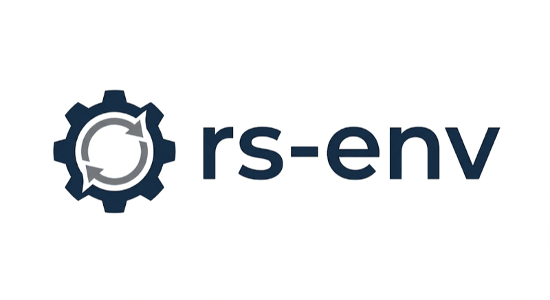
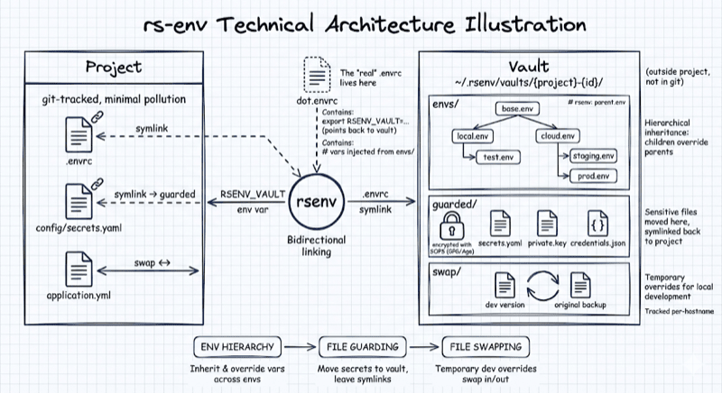

> Hierarchical environment management with secure vault storage.

[](https://opensource.org/licenses/BSD-3-Clause)
[](https://www.rust-lang.org/)

## Why?

- You work on many projects, with different teams, many repos.
- You need a personal workspace, which is attached to the project, but does not become part of its
  official repository (e.g. patched docker-compose.yml, bespoke Java test classes, etc.)
- environment configurations are not DRY, they share variables, often follow even a hierarchy
  (globlal -> company -> region -> stage)



**Solution:**
1. File/directory overrides: when work starts swap worksapce data in, after replace with
   original files, keep your personal changes in separate repo (vault)
2. Model environments as hierarchical tree and keep it DRY

**Benefit:**
- Version conrolled personal workspace per project with custom secure configuration
- Only footprint in the original repo is **one symlink** to link the project and your workspace
  (.envrc)

This is a complete rewrite of V1 with 100% functional compatibility and a lot of new features.


## Features

- **Hierarchical env files** - Link files with `# rsenv: parent.env`, children override parents
- **Vault storage** - Move sensitive files outside your project, replaced by symlinks
- **File swapping** - Overwrite files with personal versions for the duration of your work-session
- **SOPS encryption** - Encrypt sensitive files in the vault with GPG or Age
- **Shell integration** - Works seamlessly with direnv

[See all features in the wiki](https://github.com/sysid/rs-env/wiki)

## Quick Start

```bash
cargo install rsenv

rsenv init                  # Create vault for project
rsenv guard add .env        # Move .env to vault, create symlink
rsenv env tree              # View environment hierarchy
rsenv env select            # Interactive environment selection
```

[Full quick start guide](https://github.com/sysid/rs-env/wiki/Quick-Start)

## Commands

| Command | Purpose |
|---------|---------|
| `init`  | Create vault for project |
| `env`   | Manage environment hierarchy |
| `guard` | Protect sensitive files |
| `swap`  | Toggle dev/prod configs |
| `sops`  | Encrypt/decrypt vault |
| `config`| Manage settings |
| `info`  | Show project status |

[Full command reference](https://github.com/sysid/rs-env/wiki/Command-Reference)

## Documentation

**Getting Started**: [Installation](https://github.com/sysid/rs-env/wiki/Installation) · [Quick Start](https://github.com/sysid/rs-env/wiki/Quick-Start) · [Core Concepts](https://github.com/sysid/rs-env/wiki/Core-Concepts)

**Features**: [Environment Variables](https://github.com/sysid/rs-env/wiki/Environment-Variables) · [Vault Management](https://github.com/sysid/rs-env/wiki/Vault-Management) · [File Swapping](https://github.com/sysid/rs-env/wiki/File-Swapping) · [SOPS Encryption](https://github.com/sysid/rs-env/wiki/SOPS-Encryption)

**Reference**: [Commands](https://github.com/sysid/rs-env/wiki/Command-Reference) · [Configuration](https://github.com/sysid/rs-env/wiki/Configuration) · [Troubleshooting](https://github.com/sysid/rs-env/wiki/Troubleshooting) · [Migration Guide](https://github.com/sysid/rs-env/wiki/MIGRATION)

## License

BSD-3-Clause
